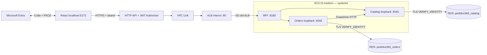
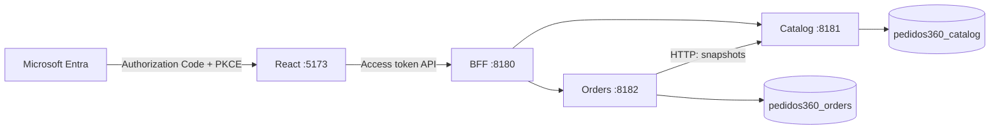

# Arquitectura de Pedidos360 — local, Entra y AWS

Despliegue comprobado en AWS:

Los dos esquemas pertenecen a una RDS MySQL privada. Cada contexto usa usuarios propios de aplicación y migración. El tramo público usa HTTPS; VPC Link/ALB/BFF usan HTTP privado con SG específicos. No se afirma cifrado TLS extremo a extremo de ese tramo interno.

Durante desarrollo local se omite Gateway y se utiliza MySQL Docker:

Catalog y Orders son bounded contexts. El BFF es una capa de integración para la SPA. Maven multimódulo organiza el build; genera tres JAR ejecutables independientes y no une los dominios en un solo proceso ni comparte una transacción.

Cada contexto tiene `domain`, `application` e `infrastructure`. El dominio y los casos de uso son Java puro. Los puertos son interfaces propias del contexto; Spring configura sus implementaciones. Los adaptadores de persistencia traducen entre domain y JPA; los controladores traducen entre domain y REST DTO. `contracts/` contiene únicamente especificaciones y artefactos técnicos HTTP. No existe common-domain ni dependencia Maven entre los tres módulos.

Catalog mantiene un modelo sencillo con producto, descripción, precio, moneda y disponibilidad. Orders contiene un agregado inmutable Order, OrderItem, Money y OwnerId. Valida de 1 a 50 líneas, cantidades de 1 a 1000, productos únicos, importes no negativos y una moneda común. Money usa BigDecimal, dos decimales sin redondeo silencioso y límite de precisión compatible con DECIMAL(19,2). Una ampliación a monedas con otras escalas requerirá una decisión explícita.

Crear pedido consulta Catalog antes de la transacción de escritura, conserva snapshots y persiste cabecera/líneas en una única transacción de Orders. Si falla la consulta, no persiste parcialmente. No hay FK hacia Catalog: `product_id` es una referencia externa. Cambios de precio posteriores no alteran el pedido. El adaptador MySQL normaliza la fecha a microsegundos para mantener el mismo contrato entre POST y GET.

El propietario proviene exclusivamente de claims validados. Las consultas propias del repositorio exigen OwnerId tanto para listar como para consultar por ID; un ID ajeno responde 404. Las credenciales y migraciones separadas refuerzan la propiedad de datos aunque el desarrollo use un mismo servidor MySQL.

## Decisiones proporcionadas al bloque

- El BFF reenvía representaciones HTTP sin modelo de negocio propio. RestClient usa destinos fijos y timeouts; no realiza reintentos automáticos del POST.
- Catálogo y pedidos exponen solo las rutas mínimas de consulta/registro. Sin eventos, broker, outbox, CQRS, common-domain ni infraestructura adicional.
- `REGISTERED` registra una solicitud. No descuenta stock, reserva, cobra ni confirma compra. Las lecturas no están paginadas en este primer conjunto pequeño de demostración; paginación y límites operativos son un pendiente antes de escalar.
- La SPA tiene rutas protegidas y cliente API central. MSAL está separado del fixture local; ambos modos son explícitos y el perfil Entra rechaza las firmas del fixture. El diseño visual aprobado se mantiene; Mi sesión y la consulta administrativa reutilizan sus clases.
- BFF, Catalog y Orders comparten un recurso OAuth con la audience de la API nueva, comprobada con token real. Cada uno valida firma, issuer, audience, tenant, azp de la SPA, versión y vigencia. Separar recursos OAuth en el futuro requiere decidir delegación, scopes y audiencias, sin compartir modelos de dominio.
- Docker es la infraestructura local y el soporte para Testcontainers. FASE 4 comparó JAR + systemd con Compose; FASE 5 desplegó tres JAR con systemd en una EC2 propia tras aprobarse el checkpoint.
- AWS desplegado: HTTP API → VPC Link → ALB interno → BFF EC2 → servicios loopback → RDS privado con TLS e identidad verificada. La ausencia de dominio propio y las restricciones Cloud Map justifican esa opción privada. No hay NAT Gateway ni hosting S3/CloudFront. Alcance y costo en [AWS_CHECKPOINT.md](AWS_CHECKPOINT.md); estado y evidencia en [DEPLOY.md](DEPLOY.md).

## Identidad y autorización

Los registros propios son pedidos360-betorrejons-frontend y pedidos360-betorrejons-api. Los IDs públicos verificados están en `config/entra-public.json`. La SPA solicita Catalog.Read, Orders.Read y Orders.Create. La creación requiere también Catalog.Read para los snapshots. Roles no sustituyen scopes: la consulta administrativa requiere Orders.Read Y Admin tanto en BFF como Orders.

`/api/v1/me` presenta una lista explícita de claims ya validados, con Cache-Control no-store. Nombre y username son solo presentación; la propiedad usa tid+oid. `/api/v1/admin/pedidos` consulta únicamente el tenant del JWT; `/api/v1/pedidos` sigue siendo la vista propia incluso para Admin. No se añaden entidades compartidas, imports entre contextos ni datos de propietarios a los DTO administrativos.

La comprobación real de roles se realizó con la variante de Admin temporal expresamente aprobada por el usuario; la asignación temporal se retiró y las dos asignaciones originales se conservaron. No se autenticó a Jazmín. Ver los registros de FASE 2 para la evidencia y los límites de revocación de tokens ya emitidos.

## Evolución futura

Inventory podría hacerse dueño de reservas y existencias; Payments de pagos, Customers de perfiles y Shipping de envíos. Notifications recibiría eventos. Esa división requiere necesidades reales del negocio y contratos propios, sin extender un modelo global.

Si aparecen transacciones distribuidas, los contextos podrán publicar eventos mediante outbox y un broker. Las políticas de consistencia y compensaciones deben definirse antes de introducir sagas; hoy la solicitud no reserva ni cobra. CQRS o read models solo se justificarían por consultas o cargas concretas.

Actuator y logs de acceso locales permiten inspección inicial. Se podrá añadir correlación/tracing y métricas sin cambiar el dominio. CI/CD, imágenes, despliegues independientes y escalamiento horizontal son evoluciones posibles; Kubernetes no es una dependencia del núcleo.

Antes de crecer, incorporar paginación/límites de consulta, requisitos de idempotencia y política operativa de revocación según el riesgo. El uso local de Docker/Testcontainers no impone el empaquetado cloud. El checkpoint AWS fue aprobado; se mantienen una EC2 y RDS Single-AZ para el laboratorio, sin afirmar alta disponibilidad.
